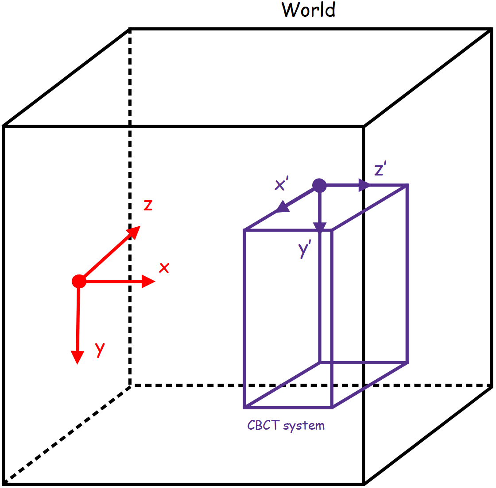
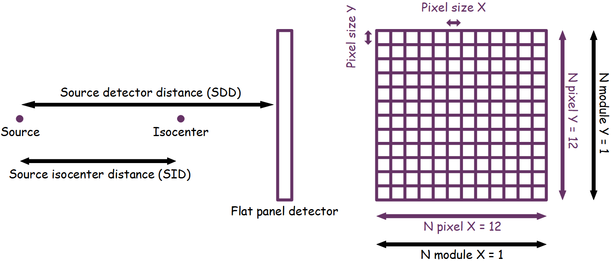
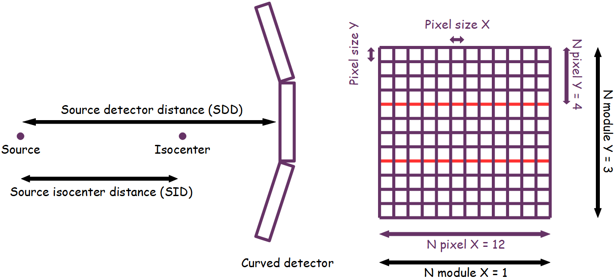

**************
CT/CBCT System
**************

In GGEMS basic CT and CBCT systems are available. The detector is made up of pixels assembled in a module. The figure below shows the reference axis of the world (in red) as well as a CT/CBCT system with its axis (in purple).

|
|

A CT/CBCT system is created using the following line:

.. code-block:: python

    cbct_system = GGEMSCTSystem('detector') # detector is a custom name for your system

Types of CT/CBCT detector are:

    * flat panel
    * curved

Flat panel
==========
This type of geometry is designed for CBCT systems.

.. code-block:: python

    cbct_system.set_ct_type('flat')

|
|

Curved
======
This type of geometry is well suited for CT systems.

.. code-block:: python

    cbct_system.set_ct_type('curved')

|
|

.. NOTE::

    For curved geometry, the angle between modules is automatically calculated. There is no gap between the modules. The center of rotation of the system is the center of the world.

For each type of detector, the number of modules, the number of detection elements inside the module and their respective sizes are set as following: 

.. code-block:: python

    cbct_system.set_number_of_modules(1, 3)
    cbct_system.set_number_of_detection_elements(12, 4, 1)
    cbct_system.set_size_of_detection_elements(1.0, 1.0, 1.0, 'mm')

A detector can be composed by only one type of material:

.. code-block:: python

    cbct_system.set_material('GOS')

An energy detection threshold can also be specified:

.. code-block:: python

    cbct_system.set_threshold(10.0, 'keV')

Source isocenter distance (SID) and source detector distance (SDD) is set with the following commands:

.. code-block:: python

    # Do not forget to add half size of detection element !!!
    cbct_system.set_source_detector_distance(1500.5, 'mm')
    cbct_system.set_source_isocenter_distance(900.0, 'mm')

.. NOTE::

    The position of the detector is calculated according to the values of the SID and SDD

A CT/CBCT system can be rotated around the world axis with the following command:

.. code-block:: python

    # 40 degree rotation around Z world axis
    cbct_system.set_rotation(0.0, 0.0, 40.0, 'deg')

A CT/CBCT system can be translated along the world axis with the following command:

.. code-block:: python

    # 400 mm translation along Z world axis
    cbct_system.set_global_system_position(0.0, 0.0, 400.0, 'mm');

The final projection including all photon interactions is saved in a file in MHD format, and scattered photons can be also save in another file.

.. code-block:: python

    cbct_system.save('projection')
    cbct_system.store_scatter(True)

To enable detector visualization and change the default color:

.. code-block:: python

    cbct_detector.set_visible(True)
    cbct_detector.set_material_color('GOS', 255, 0, 0) # Custom color using RGB
    cbct_detector.set_material_color('GOS', color_name='red') # Or using registered color

