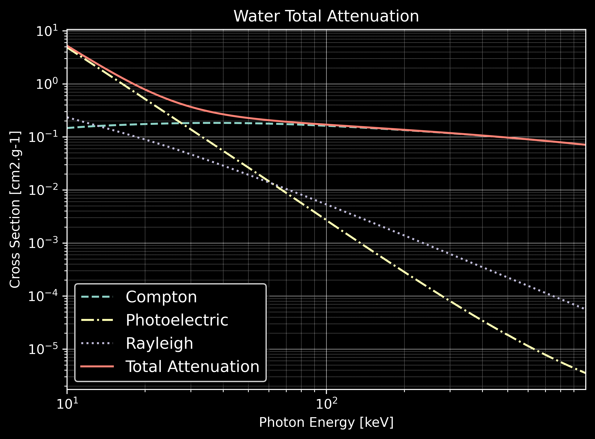
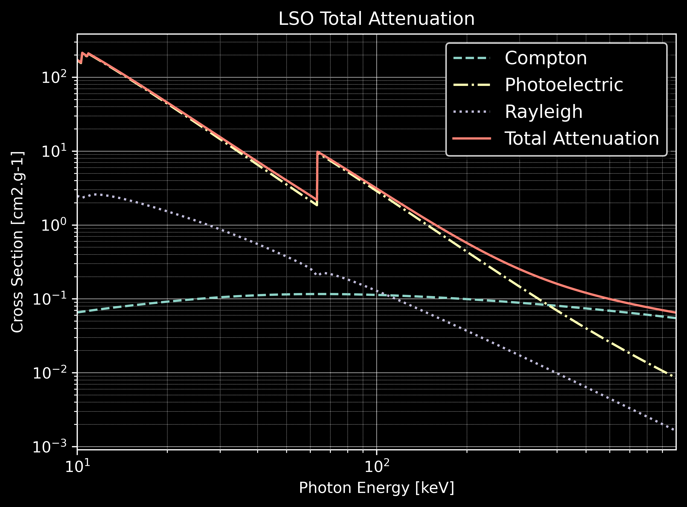

*****************************
Examples 1: Total Attenuation
*****************************

.. code-block:: console

  $ python total_attenuation.py [-h] [-d DEVICE] [-m MATERIAL] [-v VERBOSE]
  -h/--help           Printing help into the screen
  -d/--device         Setting OpenCL id
  -m/--material       Setting one of material defined in GGEMS (Water, Air, ...)
  -v/--verbose        Setting level of verbosity

Total attenuations for Water and LSO are shown below:

|
|

|
|

|
|
