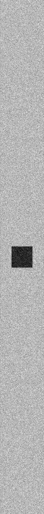

**********************
Examples 2: CT Scanner
**********************

CT scanner example : a water box is simulated associated to a CT curved detector. One projection is computed simulating 1e9 particles.

.. code-block:: console

  $ python ct_scanner.py [-h] [-d DEVICE] [-b BALANCE] [-n N_PARTICLES] [-s SEED] [-v VERBOSE]
  -h/--help           Printing help into the screen
  -d/--device         OpenCL device (all, cpu, gpu, gpu_nvidia, gpu_intel, gpu_amd, "X;Y;Z"...)
                      using all gpu: -d gpu
                      using device index 0 and 2: -d "0;2"
  -b/--balance        Balance computation for device if many devices are selected "X;Y;Z"
                      60% computation on device 0 and 40% computatio on device 2: -b "0.6;0.4"
  -n/--nparticles     Number of particles (default: 1000000)
  -s/--seed           Seed of pseudo generator number (default: 777)
  -v/--verbose        Setting level of verbosity

Load a water box phantom:

.. code-block:: python

  phantom = GGEMSVoxelizedPhantom('phantom')
  phantom.set_phantom('data/phantom.mhd', 'data/range_phantom.txt')
  phantom.set_rotation(0.0, 0.0, 0.0, 'deg')
  phantom.set_position(0.0, 0.0, 0.0, 'mm')

Create a CT curved detector:

.. code-block:: python

  ct_detector = GGEMSCTSystem('Stellar')
  ct_detector.set_ct_type('curved')
  ct_detector.set_number_of_modules(1, 46)
  ct_detector.set_number_of_detection_elements(64, 16, 1)
  ct_detector.set_size_of_detection_elements(0.6, 0.6, 0.6, 'mm')
  ct_detector.set_material('GOS')
  ct_detector.set_source_detector_distance(1085.6, 'mm')
  ct_detector.set_source_isocenter_distance(595.0, 'mm')
  ct_detector.set_rotation(0.0, 0.0, 0.0, 'deg')
  ct_detector.set_threshold(10.0, 'keV')
  ct_detector.save('data/projection')
  ct_detector.store_scatter(True)

Create a cone-beam X-ray source:

.. code-block:: python

  point_source = GGEMSXRaySource('point_source')
  point_source.set_source_particle_type('gamma')
  point_source.set_number_of_particles(1000000000)
  point_source.set_position(-595.0, 0.0, 0.0, 'mm')
  point_source.set_rotation(0.0, 0.0, 0.0, 'deg')
  point_source.set_beam_aperture(12.5, 'deg')
  point_source.set_focal_spot_size(0.0, 0.0, 0.0, 'mm')
  point_source.set_polyenergy('data/spectrum_120kVp_2mmAl.dat')

|
|

|
|

Performance on Windows 11 system and Visual C++ 2022:

+------------------------------------+------------------------+
|              Device                |  Computation Time [s]  |
+====================================+========================+
|  GeForce GTX 1050 Ti               | 112                    |
+------------------------------------+------------------------+
|  Quadro P400                       | 385                    |
+------------------------------------+------------------------+
|  RTX 4000                          | 44                     |
+------------------------------------+------------------------+
|  Xeon X-2245 8 cores / 16 threads  | 421                    |
+------------------------------------+------------------------+
| GeForce GTX 1050 Ti (80%)          |                        |
|                                    | 91                     |
| Quadro P400 (20%)                  |                        |
+------------------------------------+------------------------+

Performance on Ubuntu 20.04 and GNU GCC 9.3:

+------------------------------------+------------------------+
|              Device                |  Computation Time [s]  |
+====================================+========================+
|  GeForce GTX 1050 Ti               | 90                     |
+------------------------------------+------------------------+
|  Quadro P400                       | 360                    |
+------------------------------------+------------------------+
|  Xeon X-2245 8 cores / 16 threads  | 395                    |
+------------------------------------+------------------------+
| GeForce GTX 1050 Ti (80%)          |                        |
|                                    | 70                     |
| Quadro P400 (20%)                  |                        |
+------------------------------------+------------------------+
