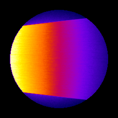
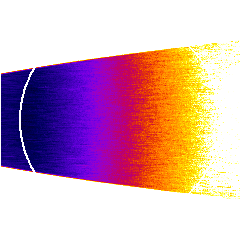
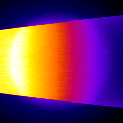

*********************
Examples 4: Dosimetry
*********************

A cylinder is simulated computing absorbed dose. Different results such as dose and energy deposited are registered in MHD files. An external source, using GGEMS X-ray source is simulated generating 2e8 particles and TLE is activated to improve statistics.

.. code-block:: console

  $ python dosimetry_photon.py [-h] [-d DEVICE] [-b BALANCE] [-n N_PARTICLES] [-s SEED] [-v VERBOSE] [-t]
  -h/--help           Printing help into the screen
  -d/--device         OpenCL device (all, cpu, gpu, gpu_nvidia, gpu_intel, gpu_amd, "X;Y;Z"...)
                      using all gpu: -d gpu
                      using device index 0 and 2: -d "0;2"
  -b/--balance        Balance computation for device if many devices are selected "X;Y;Z"
                      60% computation on device 0 and 40% computatio on device 2: -b "0.6;0.4"
  -n/--nparticles     Number of particles (default: 1000000)
  -t/--tle            Activating TLE method
  -s/--seed           Seed of pseudo generator number (default: 777)
  -v/--verbose        Setting level of verbosity

Load voxelized phantom:

.. code-block:: python

  phantom = GGEMSVoxelizedPhantom('phantom')
  phantom.set_phantom('data/phantom.mhd', 'data/range_phantom.txt')
  phantom.set_rotation(0.0, 0.0, 0.0, 'deg')
  phantom.set_position(0.0, 0.0, 0.0, 'mm')

Dosimetry associated to the previous phantom:

.. code-block:: python

  dosimetry = GGEMSDosimetryCalculator('phantom')
  dosimetry.set_output('data/dosimetry')
  dosimetry.set_dosel_size(0.5, 0.5, 0.5, 'mm')
  dosimetry.water_reference(False)
  dosimetry.minimum_density(0.1, 'g/cm3')
  dosimetry.set_tle(is_tle)

  dosimetry.uncertainty(True)
  dosimetry.photon_tracking(True)
  dosimetry.edep(True)
  dosimetry.hit(True)
  dosimetry.edep_squared(True)

External source using GGEMSXRaySource:

.. code-block:: python

  point_source = GGEMSXRaySource('point_source')
  point_source.set_source_particle_type('gamma')
  point_source.set_number_of_particles(200000000)
  point_source.set_position(-595.0, 0.0, 0.0, 'mm')
  point_source.set_rotation(0.0, 0.0, 0.0, 'deg')
  point_source.set_beam_aperture(5.0, 'deg')
  point_source.set_focal_spot_size(0.0, 0.0, 0.0, 'mm')
  point_source.set_polyenergy('data/spectrum_120kVp_2mmAl.dat')

|
|

    Dose absorbed by cylinder phantom

|
|

    Uncertainty dose computation

|
|

    Photon tracking in phantom

Performance on Windows 11 system and Visual C++ 2022:

+----------------------------------------+------------------------+
|              Device                    |  Computation Time [s]  |
+========================================+========================+
|  GeForce GTX 1050 Ti                   | 797                    |
+----------------------------------------+------------------------+
|  Quadro P400                           | 2100                   |
+----------------------------------------+------------------------+
| RTX 4000                               | 140                    |
+----------------------------------------+------------------------+
|  Xeon X-2245 8 cores / 16 threads      | 1027                   |
+----------------------------------------+------------------------+
| GeForce GTX 1050 Ti (58%)              |                        |
|                                        | 512                    |
| Xeon X-2245 8 cores / 16 threads (42%) |                        |
+----------------------------------------+------------------------+

Performance on Ubuntu 20.04 and GNU GCC 9.3:

+----------------------------------------+------------------------+
|              Device                    |  Computation Time [s]  |
+========================================+========================+
|  GeForce GTX 1050 Ti                   | 860                    |
+----------------------------------------+------------------------+
|  Quadro P400                           | 2190                   |
+----------------------------------------+------------------------+
|  Xeon X-2245 8 cores / 16 threads      | 1010                   |
+----------------------------------------+------------------------+
| GeForce GTX 1050 Ti (55%)              |                        |
|                                        | 510                    |
| Xeon X-2245 8 cores / 16 threads (45%) |                        |
+----------------------------------------+------------------------+
