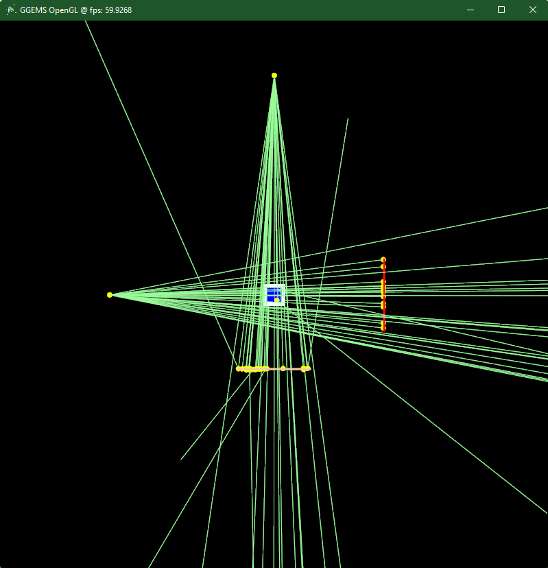
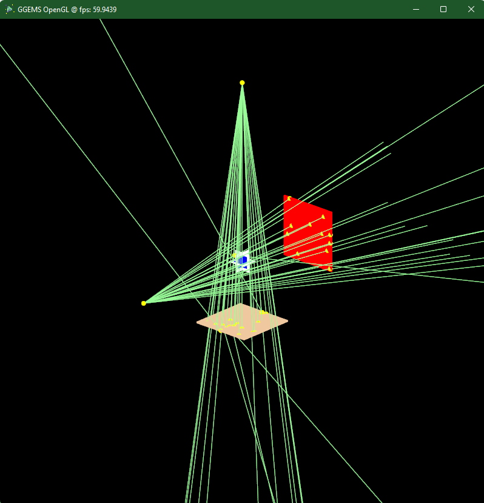

********************************
Examples 6: OpenGL Visualization
********************************

OpenGL is available since GGEMS v1.2.

.. code-block:: console

  python visualization.py [-h] [-v VERBOSE] [-e] [-w WDIMS WDIMS] [-m MSAA] [-a] [-p NPARTICLESGL] [-b] [-c WCOLOR] [-d DEVICE] [-n NPARTICLES] [-s SEED]
  -h/--help            show this help message and exit
  -v/--verbose         Set level of verbosity
  -e/--nogl            Disable OpenGL
  -w/--wdims           OpenGL window dimensions (default: [800, 800])
                       for a 400x400 window: -w 400 400
  -m/--msaa            MSAA factor (1x, 2x, 4x or 8x) (default: 8)
  -a/--axis            Drawing axis in OpenGL window
  -p/--nparticlesgl    Number of displayed primary particles on OpenGL window (max: 65536) (default: 256)
  -b/--drawgeom        Draw geometry only on OpenGL window (default: False)
  -c/--wcolor          Background color of OpenGL window (default: black)
                       using blue color for background: -c "blue"
  -d/--device          OpenCL device running visualization (default: 0)
                       only 1 device available for this example
                       using device index 0: -d 0
  -n/--nparticles      Number of particles (default: 1000000)
  -s/--seed            Seed of pseudo generator number (default: 777)

Create instance of GGEMSOpenGLManager:

.. code-block:: python

  opengl_manager = GGEMSOpenGLManager()

Many parameters can be set for OpenGL:

.. code-block:: python

  opengl_manager = GGEMSOpenGLManager()
  opengl_manager.set_window_dimensions(window_dims[0], window_dims[1])
  opengl_manager.set_msaa(msaa)
  opengl_manager.set_background_color(window_color)
  opengl_manager.set_draw_axis(is_axis)
  opengl_manager.set_world_size(3.0, 3.0, 3.0, 'm')
  opengl_manager.set_image_output('data/axis')
  opengl_manager.set_displayed_particles(number_of_displayed_particles)
  opengl_manager.set_particle_color('gamma', 152, 251, 152)
  # opengl_manager.set_particle_color('gamma', color_name='red') # Using registered color
  opengl_manager.initialize()

Display only geometry and system:

.. code-block:: python

  opengl_manager.display()

Using GGEMS for a complete visualization (geometry, system and particles):

.. code-block:: python

  ggems.run()

The OpenGL window is interactive, the scene can be moved using keyboard or mouse:

.. code-block:: console

  Keys:
      * [Esc/X]              Quit application
      * [C]                  Wireframe view
      * [V]                  Solid view
      * [R]                  Reset view
      * [K]                  Save current window to a PNG file
      * [+/-]                Zoom in/out
      * [Up/Down]            Move forward/back
      * [W/S]
      * [Left/Right]         Move left/right
      * [A/D]

  Mouse:
      * [Scroll Up/Down]     Zoom in/out
      * [Left button]        Rotation
      * [Middle button]      Translation

|
|

|
|

|
|
