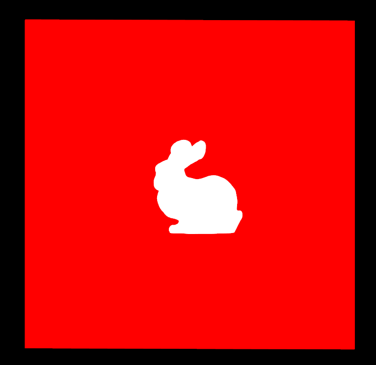
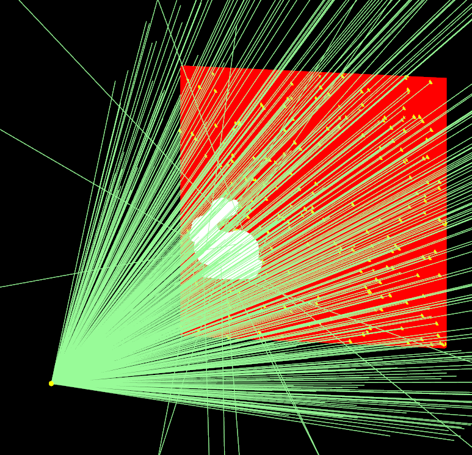
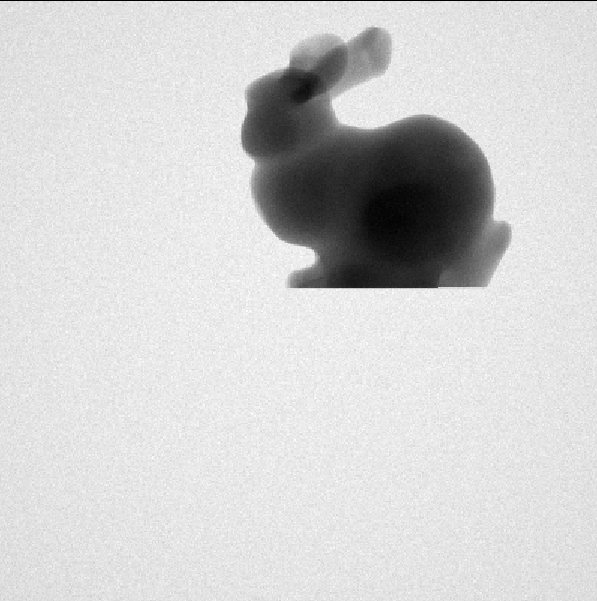

****************************
Examples 7: Meshed Navigator
****************************

Photon tracking in a meshed volume has been available since GGEMS v1.3.

.. code-block:: console

  python mesh.py [-h] [-v VERBOSE] [-e] [-w WDIMS WDIMS] [-m MSAA] [-a] [-p NPARTICLESGL] [-b] [-c WCOLOR] [-d DEVICE] [-n NPARTICLES] [-s SEED]
  -h, --help            show this help message and exit
  -v, --verbose VERBOSE
                        Set level of verbosity (default: 0)
  -e, --nogl            Disable OpenGL (default: True)
  -w, --wdims WDIMS WDIMS
                        OpenGL window dimensions (default: [800, 800])
  -m, --msaa MSAA       MSAA factor (1x, 2x, 4x or 8x) (default: 8)
  -a, --axis            Drawing axis in OpenGL window (default: False)
  -p, --nparticlesgl NPARTICLESGL
                        Number of displayed primary particles on OpenGL window (max: 65536) (default: 256)
  -b, --drawgeom        Draw geometry only on OpenGL window (default: False)
  -c, --wcolor WCOLOR   Background color of OpenGL window (default: black)
  -d, --device DEVICE   OpenCL device running visualization (default: 0)
  -n, --nparticles NPARTICLES
                        Number of particles (default: 1000000)
  -s, --seed SEED       Seed of pseudo generator number (default: 777)

As an example, a famous meshed rabbit volume is used. The projection of the meshed volumed simulating 1e9 photons.

The meshed volume is defined in GGEMS with theses commands

.. code-block:: console

  # Loading phantom in GGEMS
  mesh_phantom = GGEMSMeshedPhantom('phantom_mesh')
  mesh_phantom.set_phantom('data/Stanford_Bunny.stl')
  mesh_phantom.set_rotation(90.0, 90.0, 0.0, 'deg')
  mesh_phantom.set_position(0.0, 0.0, 0.0, 'mm')
  mesh_phantom.set_mesh_octree_depth(4)
  mesh_phantom.set_visible(True)
  mesh_phantom.set_material('Water')

A flat panel detector defined with 400x400 pixels is used

.. code-block:: console

  cbct_detector = GGEMSCTSystem('custom')
  cbct_detector.set_ct_type('flat')
  cbct_detector.set_number_of_modules(1, 1)
  cbct_detector.set_number_of_detection_elements(400, 400, 1)
  cbct_detector.set_size_of_detection_elements(1.0, 1.0, 10.0, 'mm')
  cbct_detector.set_material('GOS')
  cbct_detector.set_source_detector_distance(1500.5, 'mm') # Center of inside detector, adding half of detector (= SDD surface + 10.0/2 mm half of depth)
  cbct_detector.set_source_isocenter_distance(900.0, 'mm')
  cbct_detector.set_threshold(10.0, 'keV')
  cbct_detector.save('data/projection')

|
|

|
|

|
|

Performance on Windows 11 system and Visual C++ 2022:

+------------------------------------+------------------------+
|              Device                |  Computation Time [s]  |
+====================================+========================+
|  Quadro P400                       | 17000                  |
+------------------------------------+------------------------+
|  RTX 4000                          | 285                    |
+------------------------------------+------------------------+
|  Xeon X-2245 8 cores / 16 threads  | 19000                  |
+------------------------------------+------------------------+

