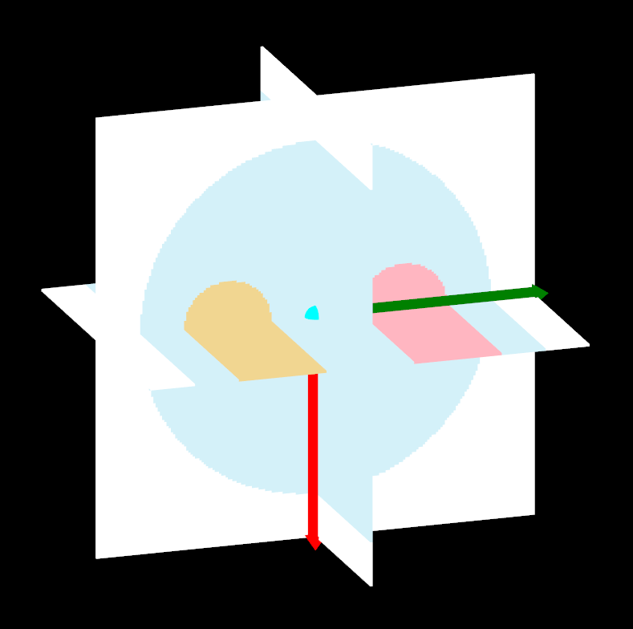
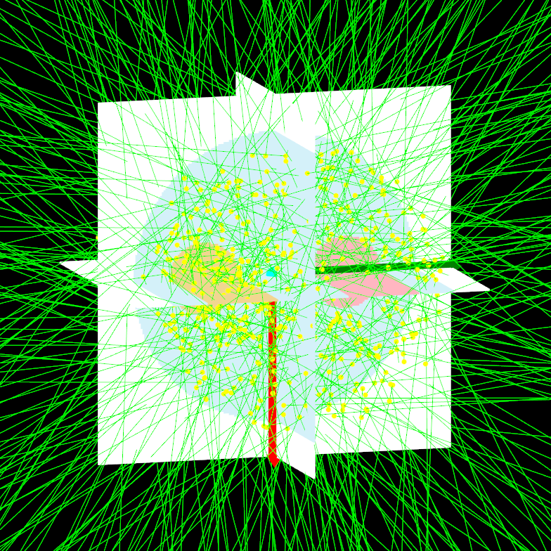

****************************
Examples 8: Voxelized Source
****************************

The voxelized source is available since GGEMS v1.3.

.. code-block:: console

  python voxelized_source.py [-h] [-d DEVICE] [-b BALANCE] [-s SEED] [-v VERBOSE] [-e] [-p NPARTICLESGL] [-c] [-n NPARTICLES]
  -h, --help            show this help message and exit
  -d, --device DEVICE   OpenCL device (all, cpu, gpu, gpu_nvidia, gpu_intel, gpu_amd, X;Y;Z...) (default: 0)
  -b, --balance BALANCE
                        X;Y;Z... Balance computation for device if many devices are selected. -b "0.5;0.5" means 50 % of computation on device 0, and 50 % of computation on device 1 (default: None)
  -s, --seed SEED       Seed of pseudo generator number (default: 777)
  -v, --verbose VERBOSE
                        Set level of verbosity (default: 0)
  -e, --nogl            Disable OpenGL (default: True)
  -p, --nparticlesgl NPARTICLESGL
                        Number of displayed primary particles on OpenGL window (max: 65536) (default: 256)
  -c, --drawgeom        Draw geometry only on OpenGL window (default: False)
  -n, --nparticles NPARTICLES
                        Number of particles (default: 1000000)

A 177Lu voxelized source example is provided

.. code-block:: console

  vox_source = GGEMSVoxelizedSource('vox_source')
  vox_source.set_phantom_source('data/phantom_src.mhd')
  vox_source.set_number_of_particles(number_of_particles)
  vox_source.set_source_particle_type('gamma')
  vox_source.set_position(0.0, 0.0, 0.0, 'mm')

  #177Lu source
  vox_source.set_energy_peak(321.3, 'keV', 0.0021)
  vox_source.set_energy_peak(249.7, 'keV', 0.0020)
  vox_source.set_energy_peak(112.9, 'keV', 0.0617)
  vox_source.set_energy_peak( 71.6, 'keV', 0.0017)
  vox_source.set_energy_peak(208.4, 'keV', 0.1036)
  vox_source.set_energy_peak(136.7, 'keV', 0.0005)

|
|

|
|

