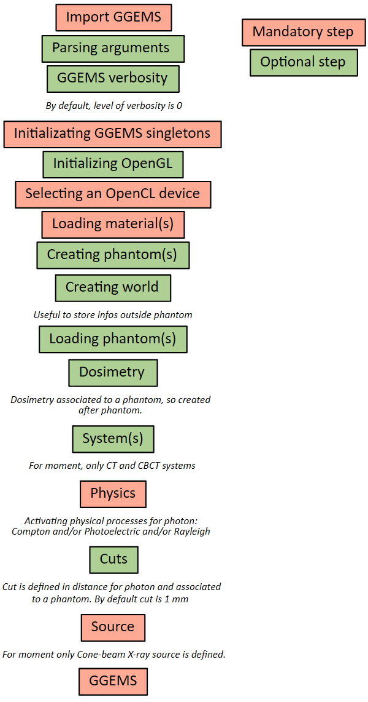

********************
Make a GGEMS Project
********************

GGEMS is a C++ library with a Python interface.

Template
========

A GGEMS macro must be written following this model:

GGEMS macro using Python
========================

Using GGEMS with python is simple. Here is a list of useful commands.

.. code-block:: python

  from ggems import *

Verbosity level is defined in the range [0;3]. For a silent GGEMS execution, the level is set to 0, otherwise 3 for lot of informations.

.. code-block:: python

  GGEMSVerbosity(0)

C++ singletons can be accessed via the following lines:

.. code-block:: python

  opencl_manager = GGEMSOpenCLManager()
  opengl_manager = GGEMSOpenGLManager()
  materials_database_manager = GGEMSMaterialsDatabaseManager()
  processes_manager = GGEMSProcessesManager()
  range_cuts_manager = GGEMSRangeCutsManager()
  volume_creator_manager = GGEMSVolumeCreatorManager()

An OpenCL device could be selected.

.. code-block:: python

  opencl_manager.set_device_index(0)

A material database must be loaded in GGEMS. A material file is provided in GGEMS in 'data' folder. This file can be copy and paste in your project, and a new material can be added inside it.

.. code-block:: python

  materials_database_manager.set_materials('materials.txt')

Photon physical processes are activated using the process name, the particle name and the associated phantom name (or 'all' for all defined phantoms).

.. code-block:: python

  processes_manager.add_process('Compton', 'gamma', 'all')
  processes_manager.add_process('Photoelectric', 'gamma', 'all')
  processes_manager.add_process('Rayleigh', 'gamma', 'all')

Physical tables can be customized by changing the number of bins and the energy range. The following values are the default values.

.. code-block:: python

  processes_manager.set_cross_section_table_number_of_bins(220)
  processes_manager.set_cross_section_table_energy_min(1.0, 'keV')
  processes_manager.set_cross_section_table_energy_max(10.0, 'MeV')

Range cuts are defined in distance, particle type must be specified and cuts are associated to a phantom (or 'all' for all defined phantoms). The distance is converted in energy during the initialization step. During the simulation, if energy particle is below to a cut, the particle is killed and the energy is locally deposited.

.. code-block:: python

  range_cuts_manager.set_cut('gamma', 0.1, 'mm', 'all')

All verboses can be set to 'True' or 'False'. In 'tracking_verbose', the second parameters is the index of particle to track. The method 'initialize' intializes all objects in GGEMS, and the simulation starts with the method 'run'.

.. code-block:: python

  ggems = GGEMS()
  ggems.opencl_verbose(True)
  ggems.material_database_verbose(True)
  ggems.navigator_verbose(True)
  ggems.source_verbose(True)
  ggems.memory_verbose(True)
  ggems.process_verbose(True)
  ggems.range_cuts_verbose(True)
  ggems.random_verbose(True)
  ggems.profiling_verbose(True)
  ggems.tracking_verbose(True, 0)

  ggems.initialize(seed) #using a custom seed
  # ggems.initialize()
  ggems.run()

And finally exit GGEMS properly:

.. code-block:: python

  ggems.delete()
  exit()

