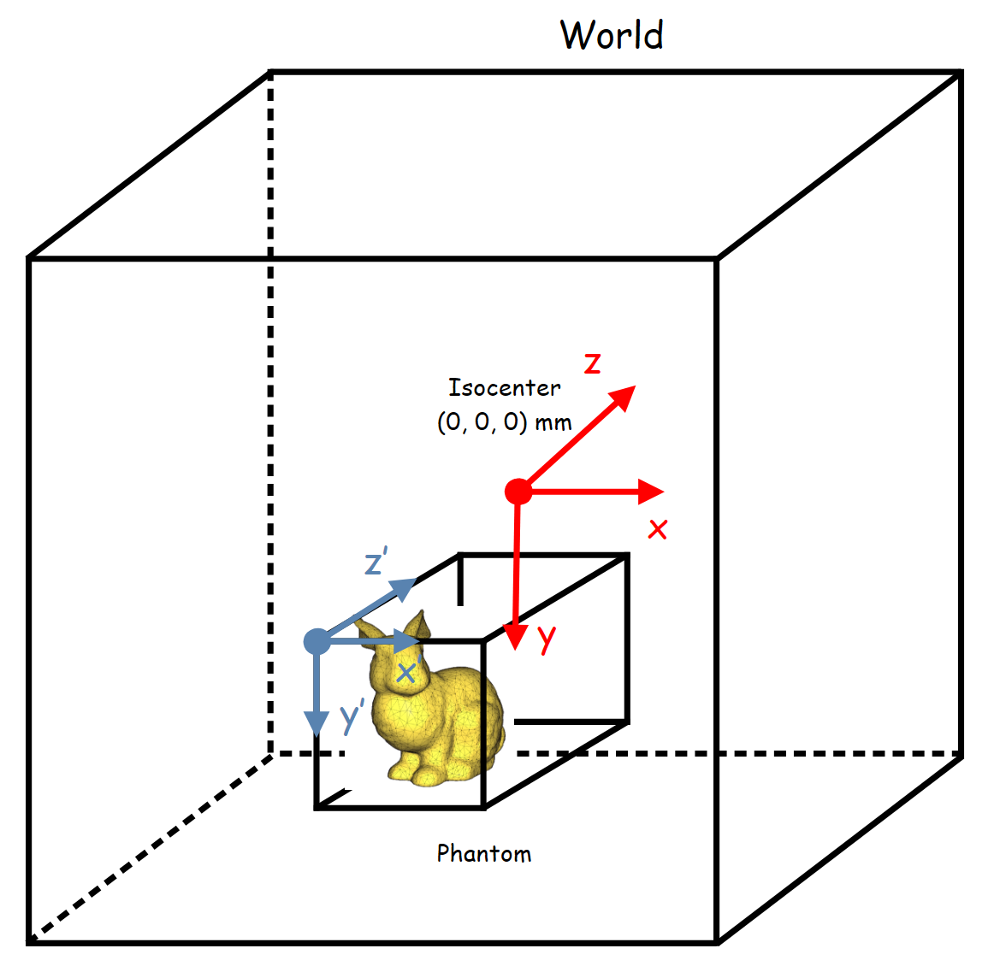

****************
Meshed Navigator
****************

Meshed navigator is useful for simulating volumes with complicated geometry. The meshed phantom must be stored in a STL file (dedicated format describing surface using triangles). To reduce computation time, photon navigation through the triangles is performed via an octree. Then the triangles are stored in the octree subdivisions, called nodes. The octree division level can be set by the user. The axis of the phantom corresponds to the axis of the world (global coordinates). It is important to note that a meshed volume is associated with only one material.

|
|

|
|

Create a meshed phantom can be done by the following commands:

.. code-block:: python

  mesh_phantom = GGEMSMeshedPhantom('phantom_mesh')
  mesh_phantom.set_phantom('data/Stanford_Bunny.stl')

The octree division level improves photon navigation. For instance, for level 1, the octree has no impact as all triangles are stored in the same node. At level 2, there are 8 nodes and navigation becomes more efficient because some triangles are excluded from the navigation. At level 3, there are 64 nodes, etc. The maximum level is 8, but this requires more memory. Level of 4 or 5 is recommended.

.. code-block:: python

  mesh_phantom.set_mesh_octree_depth(4)

The phantom can be positioned and rotated in space using the following commands:

.. code-block:: python

  mesh_phantom.set_rotation(90.0, 90.0, 0.0, 'deg')
  mesh_phantom.set_position(0.0, 0.0, 0.0, 'mm')

A material is associted to a meshed phantom with this command:

.. code-block:: python

  mesh_phantom.set_material('Water')

The voxelized phantom can be visualize by activating OpenGL. Disabling 'Air' is recommended:

.. code-block:: python

  mesh_phantom.set_visible(True)
  mesh_phantom.set_material_color('Water', color_name='white') # Uncomment for automatic color
