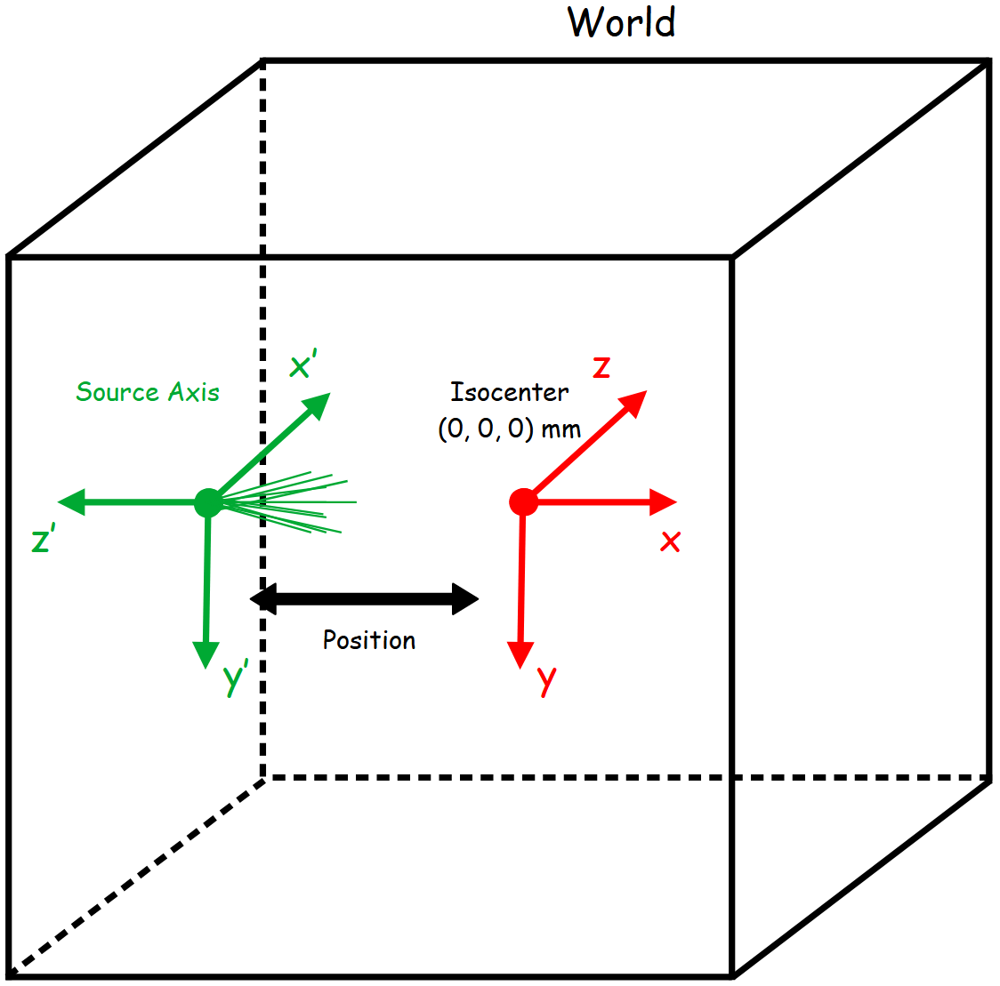

*******
Sources
*******

A Cone-beam X-Ray source has been developed in GGEMS for CT/CBCT application, and a voxelized source is also implemented. Voxelized source will be useful in next GGEMS releases for imagery application such as PET or SPECT.

CT/CBCT X-ray Source
====================
X-Ray source is defined for a cone-beam geometry. The direction of the generated photons always point to the center of the world. The source has its own local axis.

|
|

|
|

The following commands define a basic X-ray source.

.. code-block:: python

  xray_source = GGEMSXRaySource('xray_source')
  xray_source.set_source_particle_type('gamma')
  xray_source.set_number_of_particles(1000000000)
  # Position and rotation in global coordinate system
  xray_source.set_position(-595.0, 0.0, 0.0, 'mm')
  xray_source.set_rotation(0.0, 0.0, 0.0, 'deg')
  xray_source.set_beam_aperture(12.5, 'deg')
  # Focal spot size defined in local source axis
  xray_source.set_focal_spot_size(0.0, 0.0, 0.0, 'mm')

.. IMPORTANT::

  The focal spot size is defined in local source axis

Voxelized Source
================

Since GGEMS v1.3, it is possible to use a voxelised source. This will be useful when PET and SPECT imaging systems become available in GGEMS. The use of a voxelised source is very similar to that of a voxelised phantom. The user must provide a voxelised volume in MHD format, where an activity value (used as a weight) is assigned to each voxel. The source position can be defined by the user in the global coordinate system.

.. code-block:: python

  vox_source = GGEMSVoxelizedSource('vox_source')
  vox_source.set_phantom_source('data/phantom_src.mhd')
  vox_source.set_number_of_particles(100000)
  vox_source.set_source_particle_type('gamma')
  vox_source.set_position(0.0, 0.0, 0.0, 'mm')

Energy type
===========

The energy source can be defined using a single energy value, a spectrum defined as a histogram in a TXT file or discrete energy peak

.. code-block:: python

  # Single energy value for a X-ray source at 25 keV
  xray_source.set_monoenergy(25.0, 'keV')

  # Polyenergetic source for a X-ray source
  xray_source.set_polyenergy('data/spectrum_120kVp_2mmAl.dat')

  # Voxelized source with 3 peak energies at 321, 112 and 208 keV with different weights
  vox_source.set_energy_peak(321, 'keV', 0.0021)
  vox_source.set_energy_peak(112, 'keV', 0.0617)
  vox_source.set_energy_peak(208, 'keV', 0.1036)

