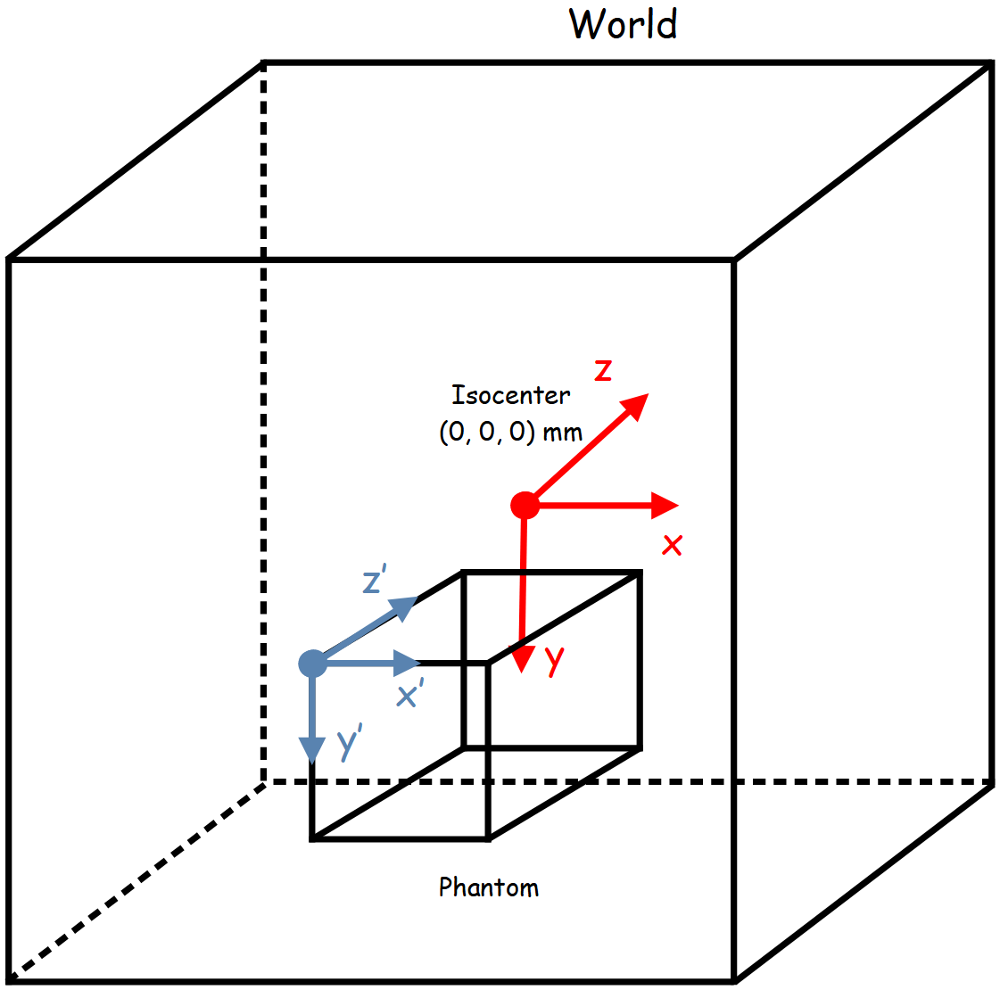

*******************
Voxelized Navigator
*******************

Voxelized navigator is useful for voxelized phantom or pixelized detector. The phantom must be described in a MHD file combined with a TXT file storing the material labels. The axis of the phantom corresponds to the axis of the world (global coordinates).

|
|

|
|

Create a voxelized phantom can be done by the following commands:

.. code-block:: python

  phantom = GGEMSVoxelizedPhantom('phantom')
  phantom.set_phantom('phantom.mhd', 'range_phantom.txt')

In the 'range_phantom.txt' are the material labels (a voxel with a value of 3 corresponds to the lung):

.. code-block:: text

  0 0 Air
  1 1 Water
  2 2 RibBone
  3 3 Lung

The phantom can be positioned and rotated in space using the following commands:

.. code-block:: python

  phantom.set_rotation(0.0, 0.0, 0.0, 'deg')
  phantom.set_position(0.0, 0.0, 0.0, 'mm')

The voxelized phantom can be visualize by activating OpenGL. Disabling 'Air' is recommended:

.. code-block:: python

  phantom.set_visible(True)
  phantom.set_material_visible('Air', False)
  phantom.set_material_color('Water', color_name='blue')

